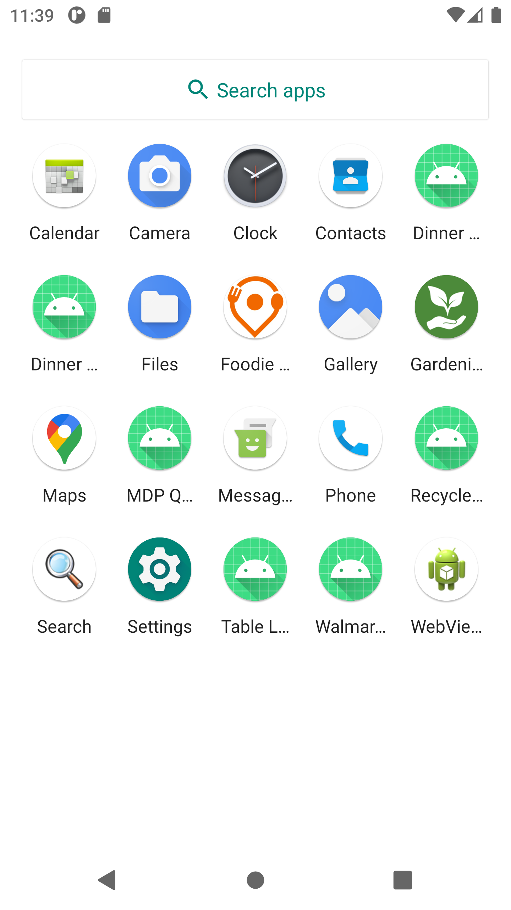
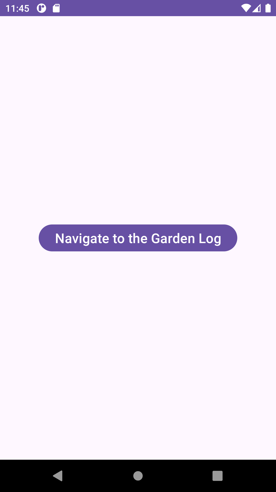
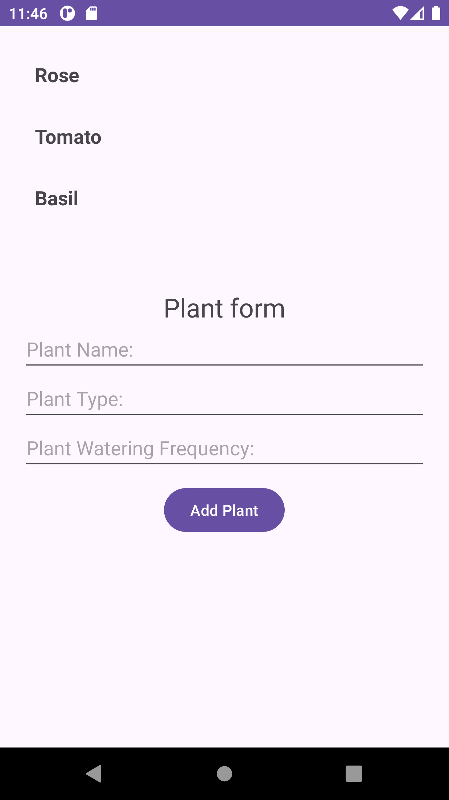
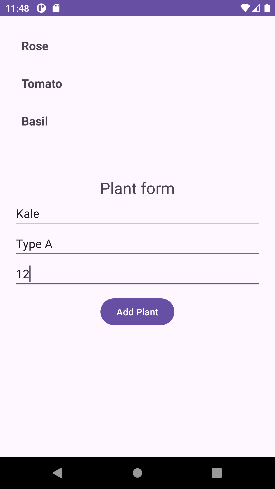
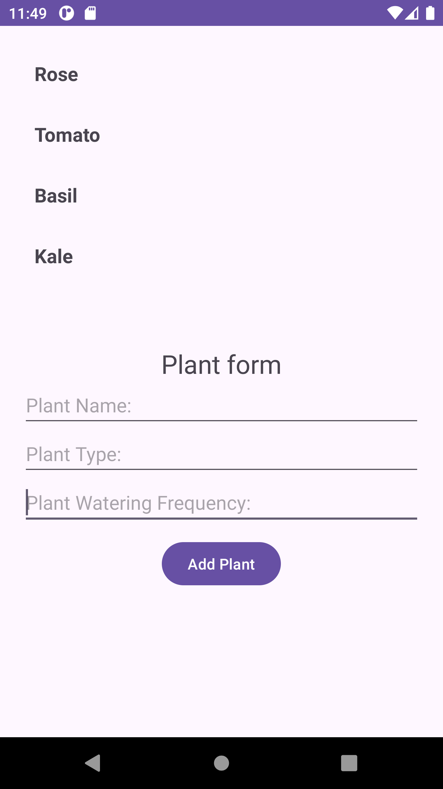
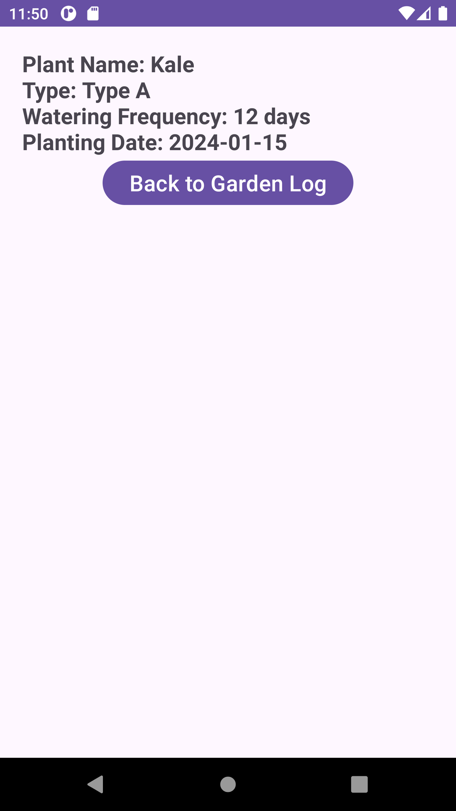

# Gardening-Journal-MDP :sunflower:

## Overview

This Android Kotlin app, titled **Gardening Journal**, features essential components like ViewModel, LiveData, Navigation, Room database, and coroutines.

## Navigation Structure

- **Home:** Overview of plants.
- **Garden Log:** Detailed activity log.
- **Plant Details:** Comprehensive plant information.

## Components

- **ViewModel and LiveData:** Responsive UI with data management.
- **Room Database:** Persistent storage for plant data.
- **Coroutines:** Asynchronous operations for smooth performance.

## App Screens

### App Icon

### Home screen

### Garden Log screen

### Add Plant to DB

### Plant Added

### Plant Details screen

## Installation
- Clone the repository.
- Open the project in Android Studio.
- Build and run the app on an Android device or emulator.

## Credits
This project was created by Fortune King.
